# Bluely 

[](https://github.com/Simeon-Azeh/bluely_main.git)
[](https://bluely-main-foyr.vercel.app/dashboard)
[](https://bluely-main.onrender.com/api/docs/)
[](https://drive.google.com/file/d/1LfhMWJUzAdqvqMSgx_L0NwzYwYWVMMO2/view?usp=sharing)
[](https://drive.google.com/drive/folders/1a6YQA8H6PYUZTZ8b4SezCYToZlKvTMR9?usp=sharing)
[](https://bluely-ml.onrender.com/health)

[](https://youtu.be/g1m0TP3f2tU)
[](https://www.figma.com/design/sALKrCy9sCOgeXcA0q99X8/Bluely?node-id=0-1&t=PITyw83mKhcfwPlQ-1)

## Links

- [GitHub Repository](https://github.com/Simeon-Azeh/bluely_main.git)
- [Live Demo](https://bluely-main-foyr.vercel.app/dashboard)
- [API Docs](https://bluely-main.onrender.com/api/docs/)
- [Final Demo Video](https://drive.google.com/file/d/1LfhMWJUzAdqvqMSgx_L0NwzYwYWVMMO2/view?usp=sharing)
- [Alternative Tests Screenshots](https://drive.google.com/drive/folders/1a6YQA8H6PYUZTZ8b4SezCYToZlKvTMR9?usp=sharing)
- [Demo Video](https://youtu.be/g1m0TP3f2tU)
- [Figma Designs](https://www.figma.com/design/sALKrCy9sCOgeXcA0q99X8/Bluely?node-id=0-1&t=PITyw83mKhcfwPlQ-1)

A web-based diabetes self-management system designed for users in low- and middle-income settings, with initial deployment targeting Cameroon. Features ML-powered glucose predictions, risk classification, HbA1c estimation, and weekly time-in-range analysis.

## Overview

Bluely is a digital health MVP that enables individuals living with diabetes to:

- **Create an account** and securely authenticate using Firebase
- **Complete onboarding** to personalize their experience
- **Log blood glucose readings** with contextual factors (time, meals, activity)
- **Log meals, medications, activities, mood, and lifestyle data**
- **Get ML-powered glucose predictions** — 30-minute forecasts and risk classification
- **View HbA1c estimates** and weekly time-in-range analysis
- **View historical data** in a clean, simple dashboard with trend insights

## Supervisor

**Bernard Lamptey** - Project Supervisor

## Tech Stack

| Component | Technology |
|-----------|------------|
| **Frontend** | Next.js 15 (React 19) |
| **Backend** | Express.js (TypeScript) |
| **ML Service** | Python FastAPI + scikit-learn |
| **Authentication** | Firebase Authentication |
| **Database** | MongoDB Atlas with Mongoose ODM |
| **ML Models** | Gradient Boosting Regressor (forecast), Random Forest Classifier (risk) |
| **Training Data** | Physiologically realistic synthetic data (200 patients, ~135K samples) |
| **Styling** | Tailwind CSS |
| **Forms** | React Hook Form + Zod validation |
| **Charts** | Recharts |
| **Deployment** | Render (3 services) |

## Project Structure

```
bluely_main/
├── frontend/                   # Next.js 15 frontend
│   ├── src/
│   │   ├── app/               # App Router pages
│   │   │   ├── dashboard/     # Main dashboard
│   │   │   ├── glucose/       # Log glucose
│   │   │   ├── meals/         # Log meals
│   │   │   ├── medications/   # Medication tracking
│   │   │   ├── history/       # Reading history
│   │   │   ├── insights/      # ML insights page
│   │   │   ├── settings/      # User settings
│   │   │   ├── login/         # Authentication
│   │   │   ├── signup/
│   │   │   └── onboarding/    # Onboarding flow
│   │   ├── components/        # Reusable components
│   │   ├── contexts/          # Auth context
│   │   └── lib/               # API client, Firebase config
│   └── public/                # Static assets, PWA manifest
│
├── backend/                    # Express.js API (TypeScript)
│   └── src/
│       ├── server.ts          # Express entry point
│       ├── config/            # DB, Firebase, Swagger config
│       ├── controllers/       # Route handlers
│       ├── middleware/         # Auth, error handling
│       ├── models/            # Mongoose models (12 models)
│       └── routes/            # API route definitions
│
├── ml/                         # Python ML service
│   ├── generate_synthetic_data.py  # Physiological simulation
│   ├── train_bluely.py        # Model training pipeline
│   ├── predict_bluely.py      # Feature engineering
│   ├── server.py              # FastAPI v3.0 server
│   ├── data/                  # Training data (generated)
│   └── models/                # Trained model files (.joblib)
│
├── render.yaml                # Render deployment blueprint
├── ML_DOCUMENTATION.md        # Full ML technical docs
└── README.md                  # This file
```

## Getting Started

### Prerequisites

- Node.js 20+
- Python 3.12
- npm or yarn
- MongoDB database (Atlas recommended)
- Firebase project

### Installation

1. **Clone the repository**
   ```bash
   git clone https://github.com/Simeon-Azeh/bluely_main.git
   cd bluely_main
   ```

### Running the ML Service

```bash
cd ml
python -m venv venv

# Windows
venv\Scripts\activate
# macOS/Linux
source venv/bin/activate

pip install -r requirements.txt

# Generate training data (first time only)
python generate_synthetic_data.py

# Train models (first time only)
python train_bluely.py

# Start the server
uvicorn server:app --host 0.0.0.0 --port 8000 --reload
```

The ML server runs at `http://localhost:8000`. Test with `curl http://localhost:8000/health`.

### Running the Backend

```bash
cd backend
npm install

# Create .env file with:
# MONGODB_URI=mongodb+srv://...
# ML_API_URL=http://localhost:8000
# FIREBASE_PROJECT_ID=your_project_id
# FIREBASE_CLIENT_EMAIL=your_service_account_email
# FIREBASE_PRIVATE_KEY=your_private_key
# PORT=5000

npm run dev
```

The backend runs at `http://localhost:5000`. API docs at `http://localhost:5000/api/docs`.

### Running the Frontend

```bash
cd frontend
npm install

# Create .env.local file with:
# NEXT_PUBLIC_API_URL=http://localhost:5000/api
# NEXT_PUBLIC_FIREBASE_API_KEY=your_api_key
# NEXT_PUBLIC_FIREBASE_AUTH_DOMAIN=your_project.firebaseapp.com
# NEXT_PUBLIC_FIREBASE_PROJECT_ID=your_project_id
# NEXT_PUBLIC_FIREBASE_STORAGE_BUCKET=your_project.appspot.com
# NEXT_PUBLIC_FIREBASE_MESSAGING_SENDER_ID=your_sender_id
# NEXT_PUBLIC_FIREBASE_APP_ID=your_app_id

npm run dev
```

The frontend runs at `http://localhost:3000`.

### Service Dependencies

Start services in this order:
1. **ML Service** (port 8000) — no dependencies
2. **Backend** (port 5000) — depends on ML service + MongoDB
3. **Frontend** (port 3000) — depends on Backend

### External Services Setup

1. **Firebase** — Create a project at [console.firebase.google.com](https://console.firebase.google.com), enable Email/Password and Google authentication
2. **MongoDB Atlas** — Create a cluster at [cloud.mongodb.com](https://cloud.mongodb.com), add your IP to the whitelist

## Features

### Authentication
- Email/password signup and login
- Password reset functionality
- Protected routes with automatic redirects

### Onboarding
- 3-step personalization flow
- Diabetes type selection
- Target glucose range configuration
- Unit preference (mg/dL or mmol/L)

### Glucose Tracking
- Quick glucose value input
- Reading type selection (fasting, before/after meal, etc.)
- Meal and activity context
- Notes for additional information
- Date/time selection

### Dashboard
- 7-day average glucose
- Time in range percentage
- Min/max readings
- Interactive line chart with target range
- Recent readings list

### History
- Paginated list of all readings
- Date range filtering
- Grouped by day
- Delete functionality
- Color-coded status indicators

### Settings
- Profile management
- Diabetes information
- Target range configuration
- Unit preferences

## Designs

### Figma Mockups
- [View Figma Designs](https://www.figma.com/design/sALKrCy9sCOgeXcA0q99X8/Bluely?node-id=0-1&t=PITyw83mKhcfwPlQ-1) 

### Screenshots
- **Landing Page**: Clean, welcoming interface with clear value proposition
- **Dashboard**: Comprehensive overview with glucose trends and quick actions
- **Glucose Logging**: Simple input form with contextual options
- **History View**: Organized list of readings with filtering capabilities
- **Settings**: Comprehensive user profile and preferences management

### Circuit Diagram
- **Hardware Integration**: Planned integration with glucometers via Bluetooth/serial connection
- **Data Flow**: Secure transmission from device to cloud database
- **Offline Capability**: Local storage with sync when connectivity is restored

## API Endpoints

### Backend API (Express)

**Users**: `POST /api/users`, `GET /api/users`, `PUT /api/users`

**Glucose Readings**: `POST /api/glucose`, `GET /api/glucose`, `GET /api/glucose/stats`, `DELETE /api/glucose/:id`

**Meals**: `POST /api/meals`, `GET /api/meals`, `DELETE /api/meals/:id`

**Medications**: `POST /api/medications`, `GET /api/medications`, `POST /api/medications/log`, `GET /api/medications/injection-site`

**Activities**: `POST /api/activities`, `GET /api/activities`

**Predictions (ML proxy)**:
- `POST /api/predict` — Risk classification with full context gathering
- `GET /api/predict/glucose-30` — 30-minute glucose forecast
- `GET /api/predict/estimate-hba1c` — HbA1c estimation from readings
- `GET /api/predict/analyze-weekly` — Weekly time-in-range analysis
- `GET /api/predict/history` — Prediction history
- `GET /api/predict/trends` — Weekly trends

**Health Profile**: `POST /api/health-profile`, `GET /api/health-profile`

**Notifications**: `GET /api/notifications`, `PATCH /api/notifications/:id/read`

### ML API (FastAPI)

| Method | Endpoint | Description |
|--------|----------|-------------|
| POST | `/predict` | Glucose risk classification |
| POST | `/predict-glucose-30` | 30-minute forecast |
| POST | `/predict-trend` | Trend prediction |
| POST | `/estimate-hba1c` | HbA1c estimation |
| POST | `/analyze-weekly` | Weekly analysis |
| GET | `/health` | Health check |

Full API documentation: `http://localhost:8000/docs` (Swagger UI)

## Design Principles

- **Simplicity**: Clean, intuitive interface
- **Accessibility**: Large touch targets, clear typography
- **Mobile-first**: Responsive design for all devices
- **Contextual feedback**: Color-coded glucose levels

## Deployment

The project deploys as 3 services on Render using the `render.yaml` blueprint:

| Service | Type | Runtime | Root Dir |
|---------|------|---------|----------|
| `bluely-ml` | Web Service | Python 3.12 | `ml` |
| `bluely-backend` | Web Service | Node 20 | `backend` |
| `bluely-frontend` | Static Site | Node 20 | `frontend` |

Deploy order: ML → Backend → Frontend (each depends on the previous).

See [ML_DOCUMENTATION.md](ML_DOCUMENTATION.md) for detailed deployment steps and environment variable configuration.

### Security Considerations
- **Data Encryption**: End-to-end encryption for sensitive health data
- **Compliance**: GDPR and HIPAA compliance for health data
- **Access Control**: Firebase auth + middleware-based API protection
- **Clinical Safety**: All ML outputs use observational language, never medical instructions

## Testing Results

### 1. Functional Testing

The application was tested to ensure that all core features operate correctly across typical user workflows.

**Features tested include:**

- Logging blood glucose readings and viewing colour-coded status indicators
- Recording meals with AI-estimated carbohydrate breakdowns
- Tracking medication and logging individual doses
- Viewing the dashboard with ML-driven insights and 30-minute forecasts
- Accessing and filtering historical records
- Using the DiaBuddy AI assistant chat with log assistance

**Screenshots:**

| Feature | Screenshot |
|---------|-----------|
| Dashboard overview | 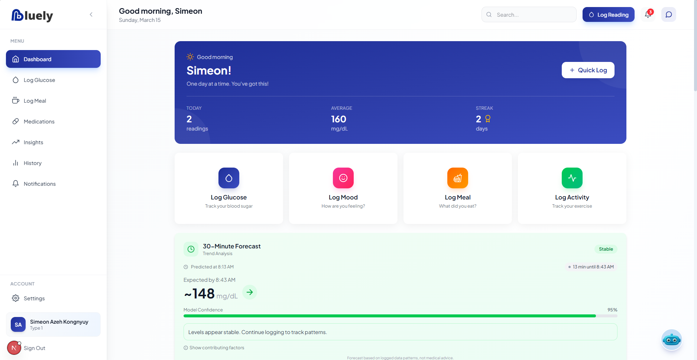 |
| Glucose log — normal reading | 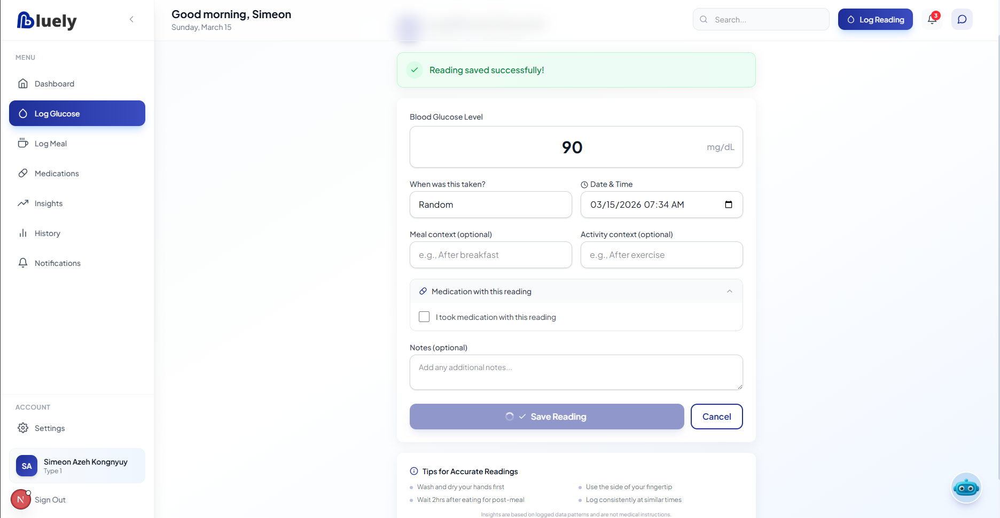 |
| Log meal with AI carb estimate | 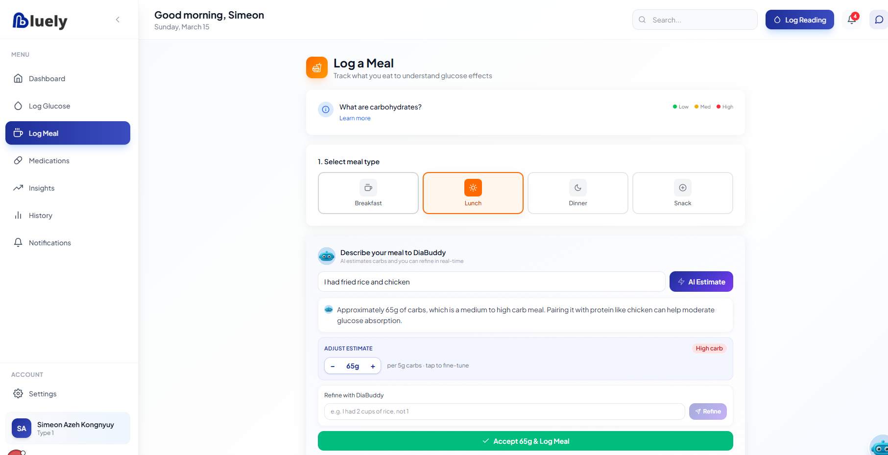 |
| Medication log with existing meds |  |
| Activity log | 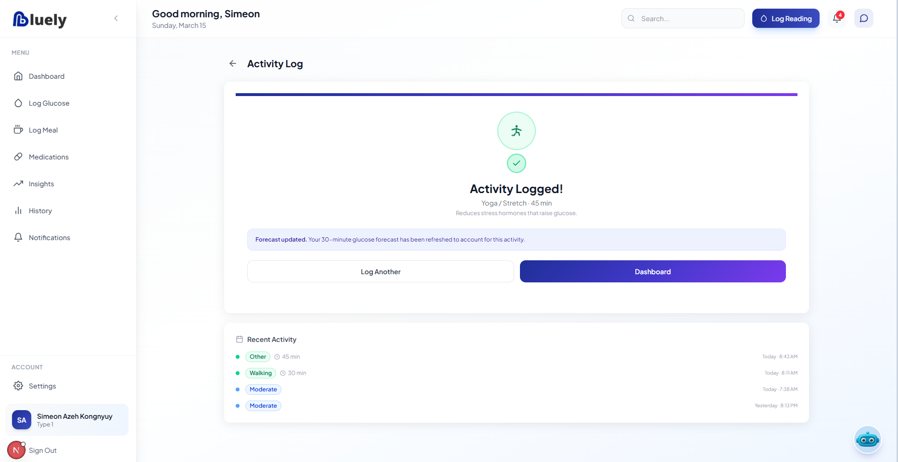 |
| Glucose history | 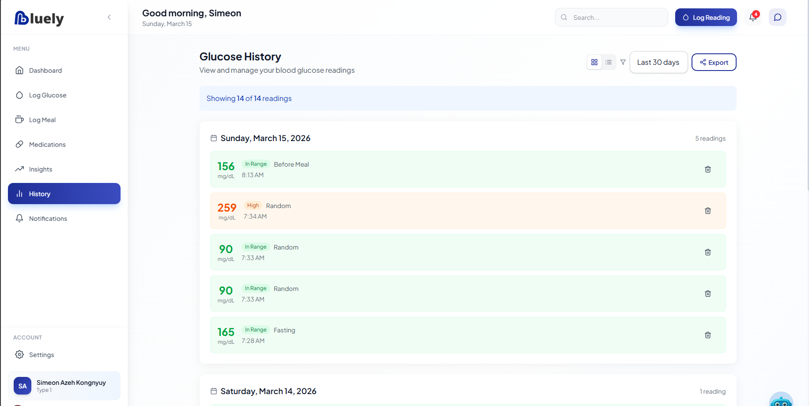 |
| Insights page | 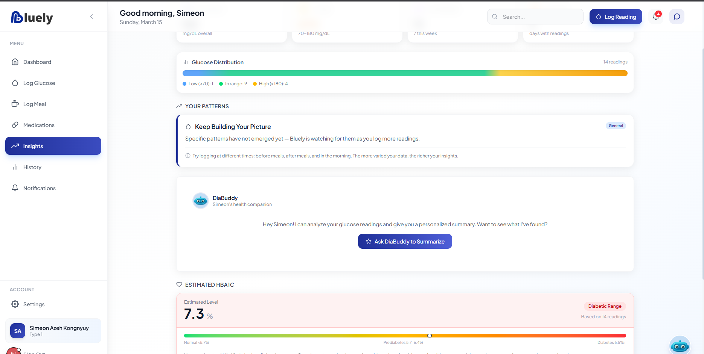 |
| Insights with AI summary | 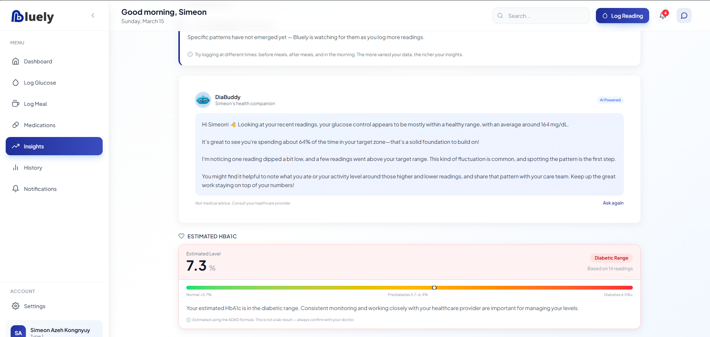 |
| Notifications | 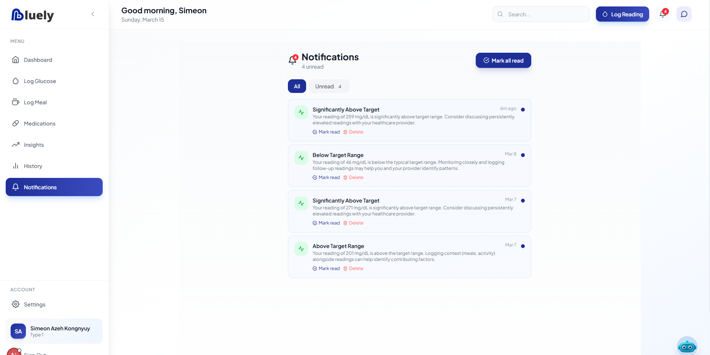 |
| AI assistant chat with log assistance | 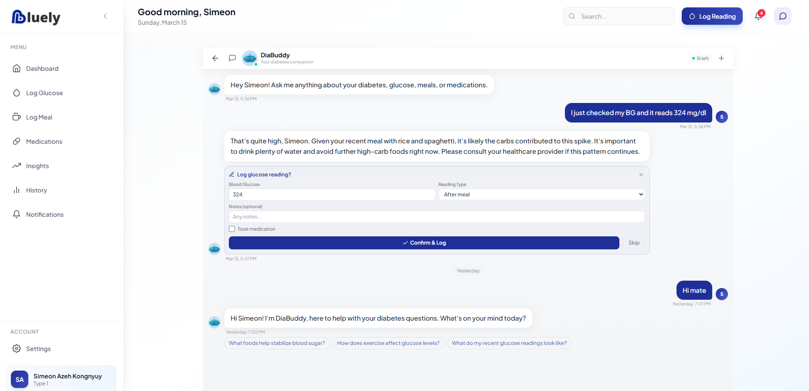 |

---

### 2. Testing with Different Data Values

The system was tested with a range of glucose values to confirm correct data processing, risk classification, and visualisation.

**Examples tested:**

| Glucose Value | Status | Result |
|--------------|--------|--------|
| 90 mg/dL | Normal | Shown in green; forecast indicates stable trend |
| 259 mg/dL | High (boundary) | Shown in amber; risk alert displayed |
| Low reading | Low | Shown in red; low glucose alert triggered |

**Screenshots:**

| Value | Screenshot |
|-------|-----------|
| Glucose — normal (90 mg/dL) |  |
| Glucose — high (259 mg/dL) | 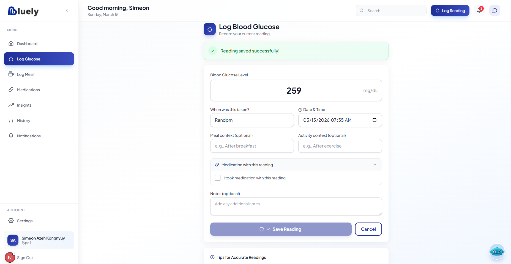 |
| Glucose — low reading | 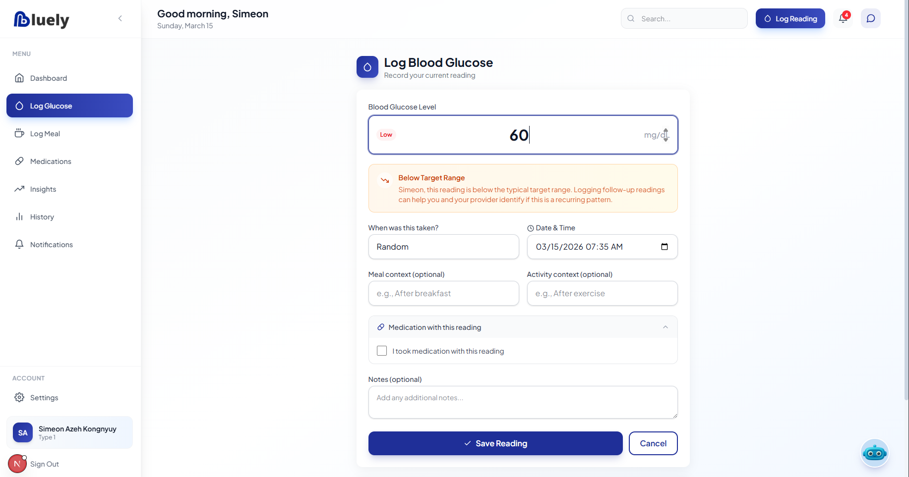 |

---

### 3. Performance & Responsiveness Testing

The application was tested across multiple device types and screen sizes to verify the responsive layout.

**Devices and environments tested:**

- Desktop browser (full-width)
- Tablet (portrait and landscape)
- Mobile Android (standard and older devices)
- PWA install and home-screen access on mobile

**Screens adapt correctly for:** navigation, dashboard cards, data entry forms, buttons stacking vertically, and history tables scrolling horizontally on narrow viewports.

**Screenshots:**

| Environment | Screenshot |
|-------------|-----------|
| Mobile dashboard | 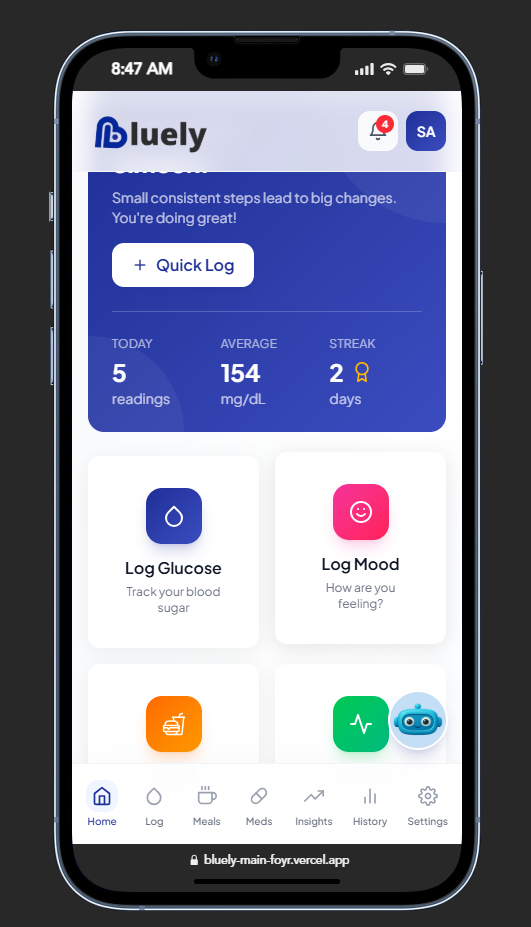 |
| Mobile Android responsiveness | 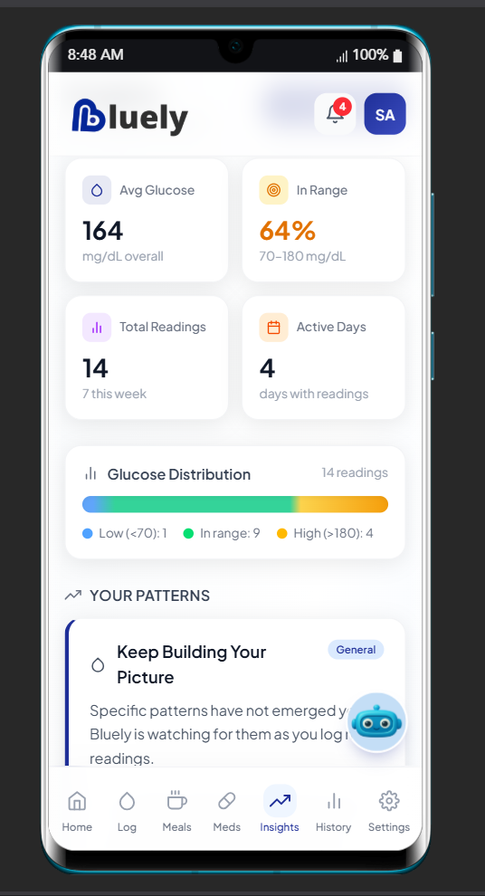 |
| Older Android device |  |
| Tablet responsiveness | 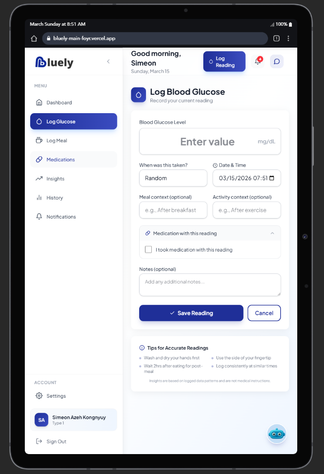 |
| Mobile PWA easy access | 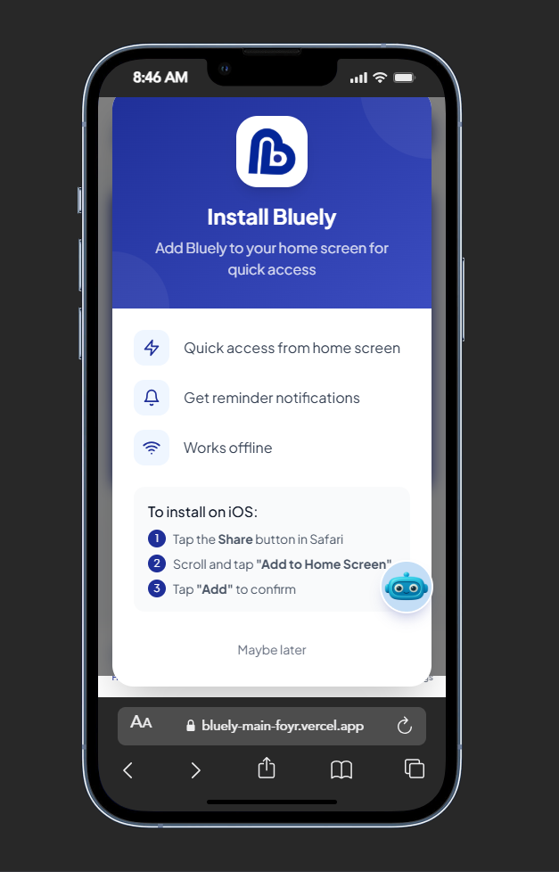 |

---

## Analysis

The testing results demonstrate that the Bluely Diabetes Management Platform successfully performs all of its core functionalities.

Users can record glucose levels, meals, medication, activity, and mood data without encountering errors. The dashboard correctly visualises this information through interactive charts, stat cards, and a 30-minute ML-powered glucose forecast, providing actionable insights in real time.

Testing with different glucose values confirmed that the system processes varied data inputs accurately — correctly classifying readings as normal, high, or low, and surfacing appropriate risk alerts and colour-coded indicators.

The DiaBuddy AI assistant provided contextual health summaries from logged data, and the AI carbohydrate estimator in the meal logging flow produced physiologically reasonable estimates.

Responsiveness testing confirmed that the platform performs well across desktop, tablet, and mobile environments. The Progressive Web App (PWA) installation worked correctly on Android, providing a native-app-like experience for mobile users in low-resource settings — a key design requirement for the Cameroonian target market.

---

## Discussion

The development milestones achieved during this project were critical in building a functional and reliable diabetes self-management platform.

Each milestone contributed to overall system functionality: from implementing secure Firebase authentication and multi-step onboarding, to designing an intuitive dashboard for data visualisation and analysis. The integration of a three-service architecture — Next.js frontend, Express/TypeScript backend, and Python FastAPI ML service — demonstrated that a full-stack ML-powered health application can be built and deployed cost-effectively on free-tier cloud infrastructure.

The ML pipeline, trained on 135,000 physiologically realistic synthetic samples, produced 30-minute glucose forecasts and risk classifications that align with known physiological patterns (e.g., post-meal rises, exercise-induced drops). The use of synthetic data addresses the real-world challenge of obtaining labelled clinical data for academic projects while still enabling meaningful model evaluation.

The testing results demonstrate that the platform can support users in actively monitoring their health data, which aligns with the project's goal: improving diabetes self-management through accessible, affordable digital tools.

A key finding from responsiveness testing is that the PWA approach is well-suited to the target population — users in Cameroon and similar LMIC settings who primarily access the internet via mobile devices, and for whom a separate native app build would increase cost and maintenance burden.

---

## Recommendations & Future Work

Although the platform successfully implements its core MVP functionality, there are several opportunities for future improvement.

### Short-term improvements

- **Lab-confirmed model training** — Replace synthetic training data with de-identified real patient data (e.g., OhioT1DM dataset integration is already scaffolded) to improve forecast accuracy
- **Push notifications** — Implement Web Push API notifications for medication reminders and high/low glucose alerts
- **Offline support** — Extend the existing service worker to cache forms and queue log submissions when the device is offline

### Medium-term features

- **Wearable device integration** — Bluetooth/BLE connectivity with consumer glucometers (e.g., Accu-Chek, FreeStyle Libre) to auto-import readings
- **Healthcare provider portal** — A separate read-only view allowing clinicians to monitor patient trends and add clinical notes
- **Multi-language support** — French localisation for deployment in Francophone Cameroon

### Long-term vision

- **Predictive alerts** — Proactive hypoglycaemia/hyperglycaemia warnings derived from continuous glucose monitor (CGM) data streams
- **Community features** — Peer support groups and anonymised benchmarking within the platform
- **Clinical trial integration** — Structured data export (HL7 FHIR) for use in research settings
- **Native mobile apps** — React Native ports of the frontend for iOS and Android app store distribution

---

## License

This project is developed for academic purposes as part of a software engineering project.

## Contributing

This is an MVP demonstration project. Contributions are welcome for educational purposes.

---

**Bluely** - Empowering diabetes self-management 
